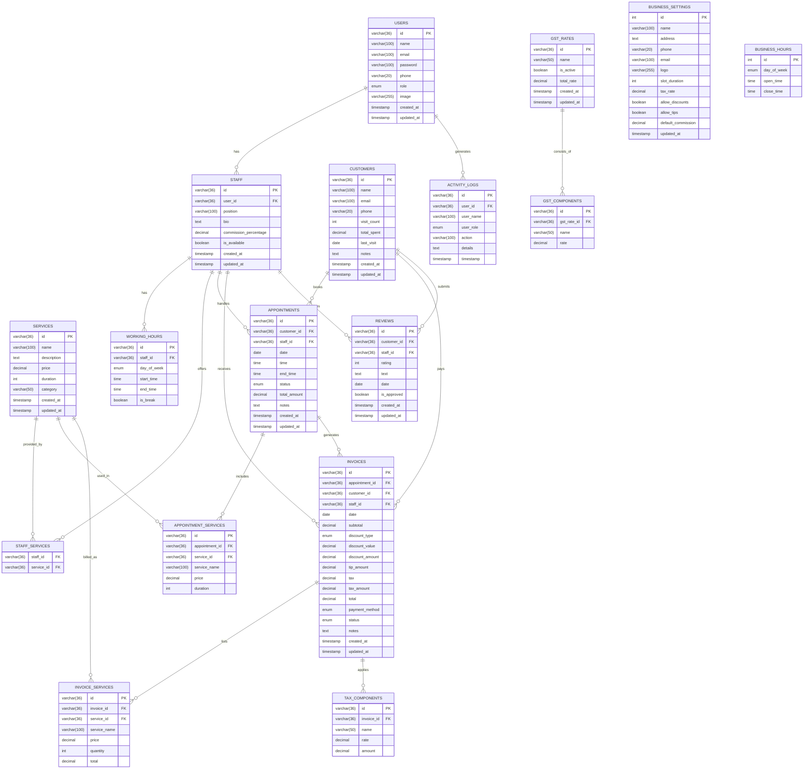

# Barber Shop Management System - API Documentation

## Overview

This document outlines the API server implementation required to support the Barber Shop Management System. The API will replace the current mock data with real functionality, enabling persistent data storage and business logic implementation.

## Technology Stack Recommendations

### Backend Framework
- **Node.js with Express.js**
  - Fast, lightweight, and excellent for JSON APIs
  - Large ecosystem of middleware

### Database: MySQL
- **Pros**:
  - Strong relational data model supports complex relationships between entities
  - ACID compliance ensures data integrity for appointments and financial transactions
  - Excellent for complex reporting and analytics
  - Mature technology with extensive documentation and community support
  - Strong query optimization capabilities
- **Cons**:
  - Less flexible schema changes compared to NoSQL
  - Additional setup for handling JSON data (for complex fields)

### ORM
- **Sequelize or TypeORM**
  - Object-Relational Mapping for MySQL
  - Simplifies database operations
  - Provides data validation and migration support

### Authentication
- **JWT (JSON Web Tokens)**
  - Stateless authentication
  - Role-based access control for admin, staff, and billing users

## Database Schema

Based on the existing frontend implementation, the following MySQL database schema is required:

### Database Tables

#### users
```sql
CREATE TABLE users (
  id VARCHAR(36) PRIMARY KEY,
  name VARCHAR(100) NOT NULL,
  email VARCHAR(100) UNIQUE NOT NULL,
  password VARCHAR(100) NOT NULL,
  phone VARCHAR(20),
  role ENUM('admin', 'staff', 'billing') NOT NULL,
  image VARCHAR(255),
  created_at TIMESTAMP DEFAULT CURRENT_TIMESTAMP,
  updated_at TIMESTAMP DEFAULT CURRENT_TIMESTAMP ON UPDATE CURRENT_TIMESTAMP
);
```

#### staff
```sql
CREATE TABLE staff (
  id VARCHAR(36) PRIMARY KEY,
  user_id VARCHAR(36) NOT NULL,
  position VARCHAR(100) NOT NULL,
  bio TEXT,
  commission_percentage DECIMAL(5,2) NOT NULL,
  is_available BOOLEAN DEFAULT TRUE,
  created_at TIMESTAMP DEFAULT CURRENT_TIMESTAMP,
  updated_at TIMESTAMP DEFAULT CURRENT_TIMESTAMP ON UPDATE CURRENT_TIMESTAMP,
  FOREIGN KEY (user_id) REFERENCES users(id) ON DELETE CASCADE
);
```

#### staff_services
```sql
CREATE TABLE staff_services (
  staff_id VARCHAR(36) NOT NULL,
  service_id VARCHAR(36) NOT NULL,
  PRIMARY KEY (staff_id, service_id),
  FOREIGN KEY (staff_id) REFERENCES staff(id) ON DELETE CASCADE,
  FOREIGN KEY (service_id) REFERENCES services(id) ON DELETE CASCADE
);
```

#### working_hours
```sql
CREATE TABLE working_hours (
  id VARCHAR(36) PRIMARY KEY,
  staff_id VARCHAR(36) NOT NULL,
  day_of_week ENUM('monday', 'tuesday', 'wednesday', 'thursday', 'friday', 'saturday', 'sunday') NOT NULL,
  start_time TIME NOT NULL,
  end_time TIME NOT NULL,
  is_break BOOLEAN DEFAULT FALSE,
  FOREIGN KEY (staff_id) REFERENCES staff(id) ON DELETE CASCADE,
  UNIQUE KEY (staff_id, day_of_week, start_time)
);
```

#### services
```sql
CREATE TABLE services (
  id VARCHAR(36) PRIMARY KEY,
  name VARCHAR(100) NOT NULL,
  description TEXT,
  price DECIMAL(10,2) NOT NULL,
  duration INT NOT NULL, -- in minutes
  category VARCHAR(50) NOT NULL,
  created_at TIMESTAMP DEFAULT CURRENT_TIMESTAMP,
  updated_at TIMESTAMP DEFAULT CURRENT_TIMESTAMP ON UPDATE CURRENT_TIMESTAMP
);
```

#### customers
```sql
CREATE TABLE customers (
  id VARCHAR(36) PRIMARY KEY,
  name VARCHAR(100) NOT NULL,
  email VARCHAR(100),
  phone VARCHAR(20) NOT NULL,
  visit_count INT DEFAULT 0,
  total_spent DECIMAL(10,2) DEFAULT 0.00,
  last_visit DATE,
  notes TEXT,
  created_at TIMESTAMP DEFAULT CURRENT_TIMESTAMP,
  updated_at TIMESTAMP DEFAULT CURRENT_TIMESTAMP ON UPDATE CURRENT_TIMESTAMP
);
```

#### appointments
```sql
CREATE TABLE appointments (
  id VARCHAR(36) PRIMARY KEY,
  customer_id VARCHAR(36) NOT NULL,
  staff_id VARCHAR(36) NOT NULL,
  date DATE NOT NULL,
  time TIME NOT NULL,
  end_time TIME NOT NULL,
  status ENUM('scheduled', 'confirmed', 'completed', 'cancelled', 'no-show') NOT NULL,
  total_amount DECIMAL(10,2) NOT NULL,
  notes TEXT,
  customer_name VARCHAR(100) NOT NULL,
  customer_phone VARCHAR(20) NOT NULL,
  customer_email VARCHAR(100),
  staff_name VARCHAR(100) NOT NULL,
  created_at TIMESTAMP DEFAULT CURRENT_TIMESTAMP,
  updated_at TIMESTAMP DEFAULT CURRENT_TIMESTAMP ON UPDATE CURRENT_TIMESTAMP,
  FOREIGN KEY (customer_id) REFERENCES customers(id) ON DELETE CASCADE,
  FOREIGN KEY (staff_id) REFERENCES staff(id) ON DELETE CASCADE
);
```

#### appointment_services
```sql
CREATE TABLE appointment_services (
  id VARCHAR(36) PRIMARY KEY,
  appointment_id VARCHAR(36) NOT NULL,
  service_id VARCHAR(36) NOT NULL,
  service_name VARCHAR(100) NOT NULL,
  price DECIMAL(10,2) NOT NULL,
  duration INT NOT NULL,
  FOREIGN KEY (appointment_id) REFERENCES appointments(id) ON DELETE CASCADE,
  FOREIGN KEY (service_id) REFERENCES services(id) ON DELETE CASCADE
);
```

#### invoices
```sql
CREATE TABLE invoices (
  id VARCHAR(36) PRIMARY KEY,
  appointment_id VARCHAR(36),
  customer_id VARCHAR(36) NOT NULL,
  staff_id VARCHAR(36) NOT NULL,
  date DATE NOT NULL,
  customer_name VARCHAR(100) NOT NULL,
  staff_name VARCHAR(100) NOT NULL,
  subtotal DECIMAL(10,2) NOT NULL,
  discount_type ENUM('percentage', 'fixed'),
  discount_value DECIMAL(10,2),
  discount_amount DECIMAL(10,2) DEFAULT 0.00,
  tip_amount DECIMAL(10,2) DEFAULT 0.00,
  tax DECIMAL(5,2) NOT NULL,
  tax_amount DECIMAL(10,2) NOT NULL,
  total DECIMAL(10,2) NOT NULL,
  payment_method ENUM('cash', 'card', 'mobile', 'pending') NOT NULL,
  status ENUM('paid', 'pending', 'cancelled') NOT NULL,
  notes TEXT,
  created_at TIMESTAMP DEFAULT CURRENT_TIMESTAMP,
  updated_at TIMESTAMP DEFAULT CURRENT_TIMESTAMP ON UPDATE CURRENT_TIMESTAMP,
  FOREIGN KEY (appointment_id) REFERENCES appointments(id) ON DELETE SET NULL,
  FOREIGN KEY (customer_id) REFERENCES customers(id) ON DELETE CASCADE,
  FOREIGN KEY (staff_id) REFERENCES staff(id) ON DELETE CASCADE
);
```

#### invoice_services
```sql
CREATE TABLE invoice_services (
  id VARCHAR(36) PRIMARY KEY,
  invoice_id VARCHAR(36) NOT NULL,
  service_id VARCHAR(36) NOT NULL,
  service_name VARCHAR(100) NOT NULL,
  price DECIMAL(10,2) NOT NULL,
  quantity INT NOT NULL,
  total DECIMAL(10,2) NOT NULL,
  FOREIGN KEY (invoice_id) REFERENCES invoices(id) ON DELETE CASCADE,
  FOREIGN KEY (service_id) REFERENCES services(id) ON DELETE CASCADE
);
```

#### tax_components
```sql
CREATE TABLE tax_components (
  id VARCHAR(36) PRIMARY KEY,
  invoice_id VARCHAR(36) NOT NULL,
  name VARCHAR(50) NOT NULL,
  rate DECIMAL(5,2) NOT NULL,
  amount DECIMAL(10,2) NOT NULL,
  FOREIGN KEY (invoice_id) REFERENCES invoices(id) ON DELETE CASCADE
);
```

#### business_settings
```sql
CREATE TABLE business_settings (
  id INT PRIMARY KEY AUTO_INCREMENT,
  name VARCHAR(100) NOT NULL,
  address TEXT NOT NULL,
  phone VARCHAR(20) NOT NULL,
  email VARCHAR(100) NOT NULL,
  logo VARCHAR(255),
  slot_duration INT NOT NULL,
  tax_rate DECIMAL(5,2) NOT NULL,
  allow_discounts BOOLEAN DEFAULT TRUE,
  allow_tips BOOLEAN DEFAULT TRUE,
  default_commission DECIMAL(5,2) NOT NULL,
  updated_at TIMESTAMP DEFAULT CURRENT_TIMESTAMP ON UPDATE CURRENT_TIMESTAMP
);
```

#### business_hours
```sql
CREATE TABLE business_hours (
  id INT PRIMARY KEY AUTO_INCREMENT,
  day_of_week ENUM('monday', 'tuesday', 'wednesday', 'thursday', 'friday', 'saturday', 'sunday') NOT NULL,
  open_time TIME,
  close_time TIME,
  UNIQUE KEY (day_of_week)
);
```

#### shop_closures
```sql
CREATE TABLE shop_closures (
  id VARCHAR(36) PRIMARY KEY,
  date DATE NOT NULL,
  reason TEXT NOT NULL,
  is_full_day BOOLEAN DEFAULT TRUE,
  start_time TIME,
  end_time TIME,
  created_at TIMESTAMP DEFAULT CURRENT_TIMESTAMP,
  updated_at TIMESTAMP DEFAULT CURRENT_TIMESTAMP ON UPDATE CURRENT_TIMESTAMP
);
```

#### gst_rates
```sql
CREATE TABLE gst_rates (
  id VARCHAR(36) PRIMARY KEY,
  name VARCHAR(50) NOT NULL,
  is_active BOOLEAN DEFAULT FALSE,
  total_rate DECIMAL(5,2),
  created_at TIMESTAMP DEFAULT CURRENT_TIMESTAMP,
  updated_at TIMESTAMP DEFAULT CURRENT_TIMESTAMP ON UPDATE CURRENT_TIMESTAMP
);
```

#### gst_components
```sql
CREATE TABLE gst_components (
  id VARCHAR(36) PRIMARY KEY,
  gst_rate_id VARCHAR(36) NOT NULL,
  name VARCHAR(50) NOT NULL,
  rate DECIMAL(5,2) NOT NULL,
  FOREIGN KEY (gst_rate_id) REFERENCES gst_rates(id) ON DELETE CASCADE
);
```

#### activity_logs
```sql
CREATE TABLE activity_logs (
  id VARCHAR(36) PRIMARY KEY,
  user_id VARCHAR(36) NOT NULL,
  user_name VARCHAR(100) NOT NULL,
  user_role ENUM('admin', 'staff', 'billing') NOT NULL,
  action VARCHAR(100) NOT NULL,
  details TEXT,
  timestamp TIMESTAMP DEFAULT CURRENT_TIMESTAMP,
  FOREIGN KEY (user_id) REFERENCES users(id) ON DELETE CASCADE
);
```

#### reviews
```sql
CREATE TABLE reviews (
  id VARCHAR(36) PRIMARY KEY,
  customer_id VARCHAR(36) NOT NULL,
  staff_id VARCHAR(36) NOT NULL,
  rating INT NOT NULL,
  text TEXT,
  date DATE NOT NULL,
  is_approved BOOLEAN DEFAULT FALSE,
  created_at TIMESTAMP DEFAULT CURRENT_TIMESTAMP,
  updated_at TIMESTAMP DEFAULT CURRENT_TIMESTAMP ON UPDATE CURRENT_TIMESTAMP,
  FOREIGN KEY (customer_id) REFERENCES customers(id) ON DELETE CASCADE,
  FOREIGN KEY (staff_id) REFERENCES staff(id) ON DELETE CASCADE
);
```

#### gallery_images
```sql
CREATE TABLE gallery_images (
  id VARCHAR(36) PRIMARY KEY,
  title VARCHAR(100) NOT NULL,
  description TEXT,
  url VARCHAR(255) NOT NULL,
  category VARCHAR(50),
  display_order INT DEFAULT 0,
  is_active BOOLEAN DEFAULT TRUE,
  created_at TIMESTAMP DEFAULT CURRENT_TIMESTAMP,
  updated_at TIMESTAMP DEFAULT CURRENT_TIMESTAMP ON UPDATE CURRENT_TIMESTAMP
);
```

## API Endpoints

### Authentication

#### POST /api/auth/login
- **Description**: Authenticates user and returns token
- **Request Body**: `{ "email": string, "password": string }`
- **Response**: `{ "token": string, "user": User }`
- **Status Codes**: 200 OK, 401 Unauthorized

#### POST /api/auth/register
- **Description**: Creates a new user account
- **Request Body**: `{ "name": string, "email": string, "password": string, "phone": string, "role": string }`
- **Response**: `{ "token": string, "user": User }`
- **Status Codes**: 201 Created, 400 Bad Request

#### GET /api/auth/me
- **Description**: Returns current user profile
- **Headers**: Authorization: Bearer [token]
- **Response**: `{ "user": User }`
- **Status Codes**: 200 OK, 401 Unauthorized

### Staff Management

#### GET /api/staff
- **Description**: Retrieves all staff members
- **Query Parameters**: `sort`, `limit`, `page`
- **Response**: `{ "staff": Staff[], "totalCount": number, "pages": number }`
- **Status Codes**: 200 OK, 401 Unauthorized

#### GET /api/staff/:id
- **Description**: Retrieves a specific staff member
- **Response**: `{ "staff": Staff }`
- **Status Codes**: 200 OK, 404 Not Found

#### POST /api/staff
- **Description**: Creates a new staff member
- **Request Body**: Staff object
- **Response**: `{ "staff": Staff }`
- **Status Codes**: 201 Created, 400 Bad Request

#### PUT /api/staff/:id
- **Description**: Updates a staff member
- **Request Body**: Staff object
- **Response**: `{ "staff": Staff }`
- **Status Codes**: 200 OK, 404 Not Found

#### DELETE /api/staff/:id
- **Description**: Deletes a staff member
- **Response**: `{ "success": boolean }`
- **Status Codes**: 200 OK, 404 Not Found

#### PUT /api/staff/:id/availability
- **Description**: Updates staff working hours
- **Request Body**: `{ "workingHours": WorkingHours }`
- **Response**: `{ "success": boolean }`
- **Status Codes**: 200 OK, 404 Not Found

### Services

#### GET /api/services
- **Description**: Retrieves all services
- **Query Parameters**: `category`, `sort`, `limit`, `page`
- **Response**: `{ "services": Service[], "totalCount": number, "pages": number }`
- **Status Codes**: 200 OK

#### GET /api/services/:id
- **Description**: Retrieves a specific service
- **Response**: `{ "service": Service }`
- **Status Codes**: 200 OK, 404 Not Found

#### POST /api/services
- **Description**: Creates a new service
- **Request Body**: Service object
- **Response**: `{ "service": Service }`
- **Status Codes**: 201 Created, 400 Bad Request

#### PUT /api/services/:id
- **Description**: Updates a service
- **Request Body**: Service object
- **Response**: `{ "service": Service }`
- **Status Codes**: 200 OK, 404 Not Found

#### DELETE /api/services/:id
- **Description**: Deletes a service
- **Response**: `{ "success": boolean }`
- **Status Codes**: 200 OK, 404 Not Found

### Appointments

#### GET /api/appointments
- **Description**: Retrieves all appointments
- **Query Parameters**: `date`, `staffId`, `customerId`, `status`, `sort`, `limit`, `page`
- **Response**: `{ "appointments": Appointment[], "totalCount": number, "pages": number }`
- **Status Codes**: 200 OK

#### GET /api/appointments/:id
- **Description**: Retrieves a specific appointment
- **Response**: `{ "appointment": Appointment }`
- **Status Codes**: 200 OK, 404 Not Found

#### POST /api/appointments
- **Description**: Creates a new appointment
- **Request Body**: Appointment object
- **Response**: `{ "appointment": Appointment }`
- **Status Codes**: 201 Created, 400 Bad Request

#### PUT /api/appointments/:id
- **Description**: Updates an appointment
- **Request Body**: Appointment object
- **Response**: `{ "appointment": Appointment }`
- **Status Codes**: 200 OK, 404 Not Found

#### DELETE /api/appointments/:id
- **Description**: Cancels an appointment
- **Response**: `{ "success": boolean }`
- **Status Codes**: 200 OK, 404 Not Found

#### GET /api/appointments/available-slots
- **Description**: Retrieves available time slots for booking
- **Query Parameters**: `date`, `staffId`, `serviceId`
- **Response**: `{ "slots": [{ "time": string, "available": boolean }] }`
- **Status Codes**: 200 OK

#### POST /api/appointments/:id/reschedule
- **Description**: Reschedules an existing appointment
- **Request Body**: `{ "date": string, "time": string }`
- **Response**: `{ "appointment": Appointment }`
- **Status Codes**: 200 OK, 404 Not Found

### Customers

#### GET /api/customers
- **Description**: Retrieves all customers
- **Query Parameters**: `search`, `sort`, `limit`, `page`
- **Response**: `{ "customers": Customer[], "totalCount": number, "pages": number }`
- **Status Codes**: 200 OK

#### GET /api/customers/:id
- **Description**: Retrieves a specific customer
- **Response**: `{ "customer": Customer }`
- **Status Codes**: 200 OK, 404 Not Found

#### POST /api/customers
- **Description**: Creates a new customer
- **Request Body**: Customer object
- **Response**: `{ "customer": Customer }`
- **Status Codes**: 201 Created, 400 Bad Request

#### PUT /api/customers/:id
- **Description**: Updates a customer
- **Request Body**: Customer object
- **Response**: `{ "customer": Customer }`
- **Status Codes**: 200 OK, 404 Not Found

#### GET /api/customers/:id/appointments
- **Description**: Retrieves customer's appointment history
- **Response**: `{ "appointments": Appointment[] }`
- **Status Codes**: 200 OK, 404 Not Found

#### GET /api/customers/:id/invoices
- **Description**: Retrieves customer's invoice history
- **Response**: `{ "invoices": Invoice[] }`
- **Status Codes**: 200 OK, 404 Not Found

### Invoices & POS

#### GET /api/invoices
- **Description**: Retrieves all invoices
- **Query Parameters**: `dateFrom`, `dateTo`, `staffId`, `customerId`, `status`, `sort`, `limit`, `page`
- **Response**: `{ "invoices": Invoice[], "totalCount": number, "pages": number }`
- **Status Codes**: 200 OK

#### GET /api/invoices/:id
- **Description**: Retrieves a specific invoice
- **Response**: `{ "invoice": Invoice }`
- **Status Codes**: 200 OK, 404 Not Found

#### POST /api/invoices
- **Description**: Creates a new invoice
- **Request Body**: Invoice object
- **Response**: `{ "invoice": Invoice }`
- **Status Codes**: 201 Created, 400 Bad Request

#### PUT /api/invoices/:id
- **Description**: Updates an invoice
- **Request Body**: Invoice object
- **Response**: `{ "invoice": Invoice }`
- **Status Codes**: 200 OK, 404 Not Found

#### POST /api/invoices/:id/send
- **Description**: Sends invoice to customer by email
- **Response**: `{ "success": boolean }`
- **Status Codes**: 200 OK, 404 Not Found

### Business Settings

#### GET /api/settings
- **Description**: Retrieves business settings
- **Response**: `{ "settings": BusinessSettings }`
- **Status Codes**: 200 OK

#### PUT /api/settings
- **Description**: Updates business settings
- **Request Body**: BusinessSettings object
- **Response**: `{ "settings": BusinessSettings }`
- **Status Codes**: 200 OK, 400 Bad Request

#### GET /api/settings/gst-rates
- **Description**: Retrieves GST rates configuration
- **Response**: `{ "gstRates": GSTRate[] }`
- **Status Codes**: 200 OK

#### PUT /api/settings/gst-rates
- **Description**: Updates GST rates configuration
- **Request Body**: `{ "gstRates": GSTRate[] }`
- **Response**: `{ "gstRates": GSTRate[] }`
- **Status Codes**: 200 OK, 400 Bad Request

### Reports & Analytics

#### GET /api/reports/dashboard
- **Description**: Retrieves dashboard statistics
- **Query Parameters**: `period` (daily, weekly, monthly)
- **Response**: Dashboard statistics object
- **Status Codes**: 200 OK

#### GET /api/reports/revenue
- **Description**: Retrieves revenue data for reports
- **Query Parameters**: `dateFrom`, `dateTo`, `groupBy` (day, week, month)
- **Response**: `{ "data": [{ "date": string, "revenue": number }] }`
- **Status Codes**: 200 OK

#### GET /api/reports/services
- **Description**: Retrieves service performance data
- **Query Parameters**: `dateFrom`, `dateTo`, `sort`
- **Response**: `{ "data": [{ "serviceId": string, "name": string, "bookings": number, "revenue": number }] }`
- **Status Codes**: 200 OK

#### GET /api/reports/staff
- **Description**: Retrieves staff performance data
- **Query Parameters**: `dateFrom`, `dateTo`, `sort`
- **Response**: `{ "data": [{ "staffId": string, "name": string, "appointments": number, "revenue": number, "commission": number }] }`
- **Status Codes**: 200 OK

### Reviews

#### GET /api/reviews
- **Description**: Retrieves all reviews
- **Query Parameters**: `approved`, `staffId`, `sort`, `limit`, `page`
- **Response**: `{ "reviews": Review[], "totalCount": number, "pages": number }`
- **Status Codes**: 200 OK

#### GET /api/reviews/:id
- **Description**: Retrieves a specific review
- **Response**: `{ "review": Review }`
- **Status Codes**: 200 OK, 404 Not Found

#### POST /api/reviews
- **Description**: Creates a new review
- **Request Body**: Review object
- **Response**: `{ "review": Review }`
- **Status Codes**: 201 Created, 400 Bad Request

#### PUT /api/reviews/:id/approve
- **Description**: Approves a review for public display
- **Response**: `{ "success": boolean }`
- **Status Codes**: 200 OK, 404 Not Found

#### DELETE /api/reviews/:id
- **Description**: Deletes a review
- **Response**: `{ "success": boolean }`
- **Status Codes**: 200 OK, 404 Not Found

### Activity Logs

#### GET /api/logs
- **Description**: Retrieves activity logs
- **Query Parameters**: `userId`, `action`, `dateFrom`, `dateTo`, `limit`, `page`
- **Response**: `{ "logs": Log[], "totalCount": number, "pages": number }`
- **Status Codes**: 200 OK

### Public Website API

#### GET /api/public/business
- **Description**: Retrieves public business information
- **Response**: Business information object
- **Status Codes**: 200 OK

#### GET /api/public/gallery
- **Description**: Retrieves gallery images for public display
- **Response**: `{ "images": [{ "id": string, "url": string, "title": string }] }`
- **Status Codes**: 200 OK

#### GET /api/public/services
- **Description**: Retrieves services for public display
- **Query Parameters**: `category`
- **Response**: `{ "services": Service[] }`
- **Status Codes**: 200 OK

#### GET /api/public/staff
- **Description**: Retrieves staff for public display
- **Response**: `{ "staff": Staff[] }`
- **Status Codes**: 200 OK

#### GET /api/public/reviews
- **Description**: Retrieves approved reviews for public display
- **Response**: `{ "reviews": Review[] }`
- **Status Codes**: 200 OK

#### POST /api/public/contact
- **Description**: Submits contact form
- **Request Body**: `{ "name": string, "email": string, "phone": string, "message": string }`
- **Response**: `{ "success": boolean }`
- **Status Codes**: 200 OK, 400 Bad Request

#### POST /api/public/booking
- **Description**: Creates a booking from public website
- **Request Body**: Booking information
- **Response**: `{ "appointment": Appointment }`
- **Status Codes**: 201 Created, 400 Bad Request

## Implementation Recommendations

### API Security
1. **HTTPS** for all connections
2. **JWT Authentication** with role-based permissions
3. **Input Validation** to prevent injection attacks
4. **Rate Limiting** to prevent abuse
5. **CORS Configuration** for frontend access

### Performance Optimization
1. **Database Indexing** for frequently queried fields
2. **Caching** for static data like services and business settings
3. **Pagination** for large data sets
4. **Query Optimization** for complex reports

### Additional Features
1. **Email Service Integration** for appointment confirmations and invoices
2. **SMS Notifications** for appointment reminders
3. **Payment Gateway Integration** for online bookings
4. **Image Upload Service** for staff photos and gallery

## Implementation Phases

### Phase 1: Core API
- Authentication and user management
- Basic CRUD operations for all entities
- Business settings

### Phase 2: Booking Logic
- Appointment scheduling with conflict detection
- Availability calculation based on staff working hours
- Shop closure handling for holidays and special events
- Business hours management
- Recurring break time handling for staff members

### Phase 3: Financial Features
- Invoice generation and management
- GST/tax calculation with multiple tax components
- Discount and tip handling
- Advanced reporting and analytics with sales trends and staff performance
- Commission calculation for staff

### Phase 4: Advanced Features
- Email and SMS notifications
- Public website API
- Reviews and ratings
- Activity logging

## Database Relationships



## Implementation Process

### 1. Database Setup
1. Create a new MySQL database
2. Execute the SQL schema definitions to create all tables
3. Create necessary indexes for performance optimization
4. Set up user privileges and security

### 2. API Server Implementation
1. Initialize a Node.js project with Express
2. Install necessary dependencies:
   ```bash
   npm install express mysql2 sequelize sequelize-cli cors dotenv jsonwebtoken bcrypt helmet express-validator uuid
   ```
3. Set up Sequelize ORM models that map to the database tables
4. Create controllers for each API endpoint
5. Implement middleware for authentication and validation
6. Configure error handling and logging

### 3. Frontend Integration
1. Update the frontend service layer to connect to the API instead of using mock data
2. Implement authentication token management
3. Add error handling for API responses
4. Ensure the UI updates appropriately based on API responses

## Conclusion

This API documentation provides a comprehensive roadmap for implementing the backend services required by the Barber Shop Management System. MySQL is recommended as the database due to its strong relational data model, excellent support for complex queries needed in reporting, and ACID compliance for ensuring data integrity in financial transactions.

The implementation should follow REST principles with proper authentication, authorization, and error handling to ensure a secure and robust system. Using Sequelize as an ORM will simplify database operations while maintaining type safety and validation.